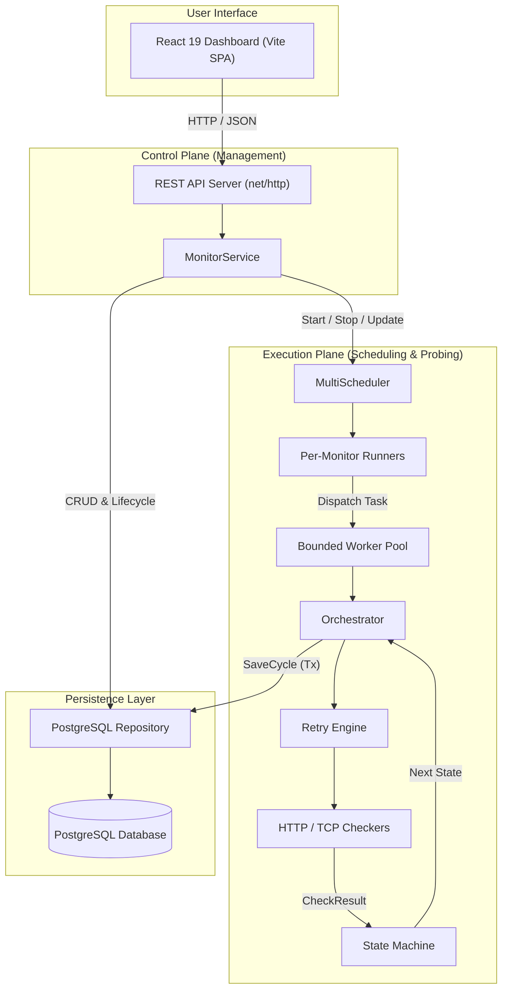

# Deployment Watchdog

A high-reliability, self-hosted endpoint monitoring and runtime observability system written in Go, backed by PostgreSQL, with a modern React 19 management dashboard.

---

## Overview

Modern software deployments frequently suffer from silent outages: portfolio sites return 404s after silent DNS changes, databases hang on exhausted connection pools, or background workers fail without triggering immediate alerts.

**Deployment Watchdog** solves this by providing continuous, deterministic uptime verification for HTTP and TCP services. It runs a recurring execution engine with bounded worker concurrency, handles transient failures via jittered exponential backoff, records health state transitions, persists complete check execution history in PostgreSQL, and exposes control through a REST API and a dense, responsive React management dashboard.

---

## Current Status

* **Phase 1–6 Complete**: Core engine, PostgreSQL persistence, application runtime, bounded worker pool scheduling, REST API lifecycle management, and React management dashboard are fully implemented and verified.
* **Next Phase**: **Phase 7 — Observability** (structured logging, metrics export, OpenTelemetry tracing, and alerting).

---

## Core Features

* **HTTP Health Checks**: Probes HTTP/HTTPS targets with configurable verbs (`GET`, `POST`, `PUT`, `HEAD`, `DELETE`, `PATCH`), expected status code matching (single code or ranges such as `200-299`), and microsecond-level latency measurement.
* **TCP Connectivity Checks**: Connects to raw `host:port` targets to verify network reachability, socket handshakes, and transport availability.
* **Context-Aware Execution & Timeouts**: Strict per-check timeout enforcement with context cancellation across all network I/O.
* **Deterministic Retry Engine**: Retries failed attempts with exponential backoff and randomized jitter before recording a confirmed failure.
* **State Machine Evaluation**: Maintains authoritative health state (`UNKNOWN`, `HEALTHY`, `UNHEALTHY`) with explicit transition rules.
* **Transactional PostgreSQL Persistence**: Atomic state updates and check result insertions within database transactions.
* **Per-Monitor Independent Runners**: Each active monitor operates on its own recurring schedule without cross-monitor blocking.
* **Bounded Worker Pool Concurrency**: Configurable global worker pool prevents socket exhaustion and system overload during multi-monitor fan-out.
* **Runtime Lifecycle Management**: Dynamically create, edit, enable/pause, and delete monitors at runtime without restarting the server.
* **REST API**: Built with Go's standard library `net/http` pattern matching, offering structured JSON error envelopes and status mapping.
* **React Management Dashboard**: Vite + React 19 + TypeScript SPA with live health summary cards, responsive tabular views, inline controls, and check history inspection.
* **Dynamic Polling**: Automatic UI synchronization that adapts to each monitor's configured interval while pausing background network activity when tabs are hidden.
* **Graceful Shutdown**: Intercepts `SIGINT` / `SIGTERM` signals to cleanly drain the worker pool, stop active scheduler runners, and shut down the HTTP server without dropped checks.
* **Race & Concurrency Safe**: Verified with the Go race detector (`go test -race ./...`).

---

## Architecture

Deployment Watchdog separates concerns across three core planes: **Control Plane (Management)**, **Execution Plane (Scheduling & Checking)**, and **Persistence Layer**.



### Architectural Separation
1. **Control Plane**: Handlers deserialize requests, validate domain payloads, and invoke `MonitorService`. `MonitorService` coordinates repository operations with `MultiScheduler` control operations (`StartMonitor`, `StopMonitor`, `UpdateMonitor`), applying compensating rollbacks if any downstream step fails.
2. **Execution Plane**: The `MultiScheduler` manages an independent `Runner` goroutine for each active monitor. Each cycle dispatches an execution task to a global `Pool` with a fixed concurrency limit. The worker executes the `Orchestrator`, which runs the `Retry` engine and target `Checker`, evaluates state transitions, and persists results.
3. **Persistence Layer**: Encapsulated behind the `persistence.Repository` interface with a PostgreSQL implementation using transactional guarantees.

---

## Technology Stack

### Backend
* **Language**: Go 1.26.5
* **HTTP Routing & Server**: Go Standard Library `net/http` (Go 1.22+ ServeMux routing)
* **Database Driver**: `github.com/jackc/pgx/v5` (`stdlib`)
* **Standard Concurrency**: Go channels, `sync.Mutex`, `sync.WaitGroup`, `context.Context`

### Database
* **Engine**: PostgreSQL 14+
* **Migrations**: Versioned SQL schema files (`migrations/`)

### Frontend
* **UI Framework**: React 19 + TypeScript
* **Build Tool & Dev Server**: Vite 6
* **Styling**: Tailwind CSS v4
* **Server State & Caching**: TanStack Query v5 (`@tanstack/react-query`)
* **Client-Side Routing**: React Router v7 (`react-router-dom`)
* **Icons**: Lucide React

---

## Project Structure

```
Deployment WatchDog/
├── cmd/
│   └── watchdog/                   # Application entrypoint (signal handling, wiring, runtime execution)
├── internal/
│   ├── api/                        # REST API handlers, routing, JSON models, and HTTP server
│   ├── checker/                    # HTTP and TCP probing engines and CheckResult definitions
│   ├── monitor/                    # Core monitor domain entity and protocol kind definitions
│   ├── persistence/                # Repository interface specifications
│   │   └── postgres/               # PostgreSQL repository implementation and transactional queries
│   ├── retry/                      # Retry executor with exponential backoff and jitter
│   ├── scheduler/                  # MultiScheduler, per-monitor Runner, and execution Orchestrator
│   ├── service/                    # MonitorService business logic and scheduler lifecycle reconciliation
│   ├── state/                      # Health state machine and transition logic
│   └── worker/                     # Bounded worker concurrency pool
├── migrations/
│   ├── 001_initial_schema.up.sql   # Core tables: monitors, monitor_states, check_results
│   ├── 001_initial_schema.down.sql
│   ├── 002_monitor_scheduling_fields.up.sql # Adds interval_ms, timeout_ms, and enabled
│   └── 002_monitor_scheduling_fields.down.sql
└── web/                            # React 19 + TypeScript SPA
    ├── src/
    │   ├── api/                    # Typed fetch client and endpoint functions
    │   ├── components/             # Reusable UI elements (Badges, Cards, Modals, Tables)
    │   ├── hooks/                  # React Query hooks (useMonitors, useMonitorDetail, useMonitorMutations)
    │   ├── types/                  # TypeScript domain types mirroring Go backend structs
    │   ├── utils/                  # Duration formatters, timestamp helpers, and validation rules
    │   └── views/                  # DashboardView, MonitorDetailView, NotFoundView
    ├── package.json
    ├── tsconfig.json
    └── vite.config.ts
```

---

## Monitoring Model

Every monitor defines a recurring check against a specific network target:

### HTTP Checks
* **Target**: Valid `http://` or `https://` URL with a resolvable host.
* **Method**: `GET`, `POST`, `PUT`, `HEAD`, `DELETE`, `PATCH` (defaults to `GET`).
* **Expected Status**: Single code (e.g. `200`) or range (e.g. `200-299`).
* **Error Classification**: Identifies root failure causes such as `dns`, `conn_refused`, `tls`, `timeout`, or `status`.

### TCP Checks
* **Target**: `host:port` address (e.g. `127.0.0.1:5432`, `db.internal:3306`).
* **Protocol Rule**: Verifies standard TCP handshake completion. HTTP-specific fields (`method`, `expected_status_range`) are omitted.
* **Error Classification**: Categorizes connection refusals, timeouts, and DNS resolution failures.

### Check Results & State Evaluation
Each completed monitoring cycle generates an immutable `CheckResult`:
* `ok`: Boolean indicating pass or fail.
* `latency`: Duration taken for the check cycle to complete.
* `status_code`: HTTP status code when present; omitted on TCP or connection-level failures.
* `attempt_count`: Number of probe attempts made during the retry cycle.
* `error_class` / `error_detail`: Category and detail message for failures.

Health state is tracked separately in `monitor_states` and transitions deterministically based on cycle results:
* `UNKNOWN` $\rightarrow$ Initial state until the first check cycle finishes.
* `HEALTHY` $\rightarrow$ Confirmed active after a successful check.
* `UNHEALTHY` $\rightarrow$ Declared after probe failures persist through the retry cycle.

---

## Retry Behavior

Transient network blips should not trigger false alarms. Deployment Watchdog incorporates an internal retry loop before recording a failed cycle:

* **Bounded Attempts**: Up to 3 attempts per cycle.
* **Exponential Backoff**: Increasing delay between attempts ($100\text{ms} \times 2^{\text{attempt}}$).
* **Randomized Jitter**: Prevents synchronized retry storms across concurrent checks.
* **Cancellation Awareness**: If the monitor's overall timeout expires or the server initiates a shutdown, retries abort immediately.
* **Execution Errors vs Target Failures**: Domain configuration errors (e.g. malformed URLs) fail immediately without wasteful retries.

---

## Scheduler / Worker Pool

1. **Per-Monitor Runners**: Each enabled monitor receives a dedicated background `Runner` goroutine.
2. **Fixed-Delay Scheduling**: Next cycle begins strictly after the configured `interval_ms` following the completion of the prior cycle, guaranteeing **no overlapping checks for the same monitor**.
3. **Bounded Concurrency**: Individual runners do not execute network checks directly; instead, they queue an execution task into the worker `Pool`.
4. **Global Concurrency Ceiling**: The pool maintains a bounded number of worker goroutines (`WATCHDOG_WORKER_CONCURRENCY`, default 5), protecting local and target resources.
5. **Isolation**: A stalled or slow check on one target cannot exhaust system threads or block independent runners.

---

## Persistence

Deployment Watchdog uses PostgreSQL with explicit schema definitions:

```sql
-- monitors: Stores target configuration
CREATE TABLE monitors (
    id UUID PRIMARY KEY,
    name TEXT NOT NULL,
    kind TEXT NOT NULL,
    target TEXT NOT NULL,
    method TEXT NULL,
    expected_status_range TEXT NULL,
    interval_ms BIGINT NOT NULL DEFAULT 60000 CHECK (interval_ms > 0),
    timeout_ms BIGINT NOT NULL DEFAULT 5000 CHECK (timeout_ms > 0),
    enabled BOOLEAN NOT NULL DEFAULT true,
    created_at TIMESTAMPTZ NOT NULL DEFAULT NOW(),
    updated_at TIMESTAMPTZ NOT NULL DEFAULT NOW()
);

-- monitor_states: Stores authoritative health state (1:1 with monitors)
CREATE TABLE monitor_states (
    monitor_id UUID PRIMARY KEY REFERENCES monitors(id) ON DELETE CASCADE,
    state TEXT NOT NULL,
    updated_at TIMESTAMPTZ NOT NULL DEFAULT NOW()
);

-- check_results: Append-only execution history (1:N with monitors)
CREATE TABLE check_results (
    id BIGSERIAL PRIMARY KEY,
    monitor_id UUID NOT NULL REFERENCES monitors(id) ON DELETE CASCADE,
    ok BOOLEAN NOT NULL,
    status_code INTEGER NULL,
    latency_ms BIGINT NOT NULL CHECK (latency_ms >= 0),
    error_class TEXT NULL,
    error_detail TEXT NULL,
    attempt_count INTEGER NOT NULL CHECK (attempt_count > 0),
    checked_at TIMESTAMPTZ NOT NULL
);
CREATE INDEX idx_check_results_monitor_checked_at ON check_results (monitor_id, checked_at DESC);
```

### Transactional Guarantees
* **Creation**: Inserting a monitor and its initial `UNKNOWN` state occurs in a single database transaction.
* **Execution**: Recording a `CheckResult` and updating the `monitor_states` row occurs atomically in a transaction at the end of each cycle.
* **Deletion**: Foreign keys use `ON DELETE CASCADE`, ensuring check results and states are cleaned up atomically.

---

## REST API

All API routes are rooted at `/`:

| Method | Route | Description | Success Code |
|---|---|---|---|
| `POST` | `/monitors` | Create a new monitor and schedule it if enabled | `201 Created` |
| `GET` | `/monitors` | List all configured monitors | `200 OK` |
| `GET` | `/monitors/{id}` | Retrieve monitor configuration by UUID | `200 OK` |
| `PATCH` | `/monitors/{id}` | Update monitor fields (kind is immutable) | `200 OK` |
| `DELETE` | `/monitors/{id}` | Stop runner and delete monitor from database | `204 No Content` |
| `GET` | `/monitors/{id}/status` | Retrieve current health state and timestamp | `200 OK` |
| `GET` | `/monitors/{id}/checks` | Get recent check results history (`?limit=N`, max 100) | `200 OK` |

### Error Format
All errors return a standard JSON envelope:
```json
{
  "error": {
    "code": "INVALID_ARGUMENT",
    "message": "interval_ms must be at least 1000ms",
    "details": null
  }
}
```

---

## Frontend

The frontend is a dedicated Single Page Application in `web/`:

* **Dashboard (`/`)**:
  * **Summary Metrics**: Total monitors, Healthy (green), Unhealthy (red), Unknown (zinc), and Paused (amber).
  * **Filter Bar**: Text search across name and target, protocol filter (All / HTTP / TCP), and status filter.
  * **Monitor Table**: Displays endpoint name, target, protocol badge, health state, relative update timestamp, interval/timeout, optimistic active toggle, and action controls.
  * **Empty States**: Contextual messages distinguishing between an unconfigured system and zero matching filter results.
* **Detail Page (`/monitors/:id`)**:
  * Header with breadcrumbs, target URL, protocol badge, and live health status badge.
  * Configuration card detailing all probe parameters.
  * Live-polling recent checks table with pass/fail indicators, response codes, latency (ms), retry counts, and expandable error tracebacks.
  * Limit switcher supporting 10, 20, 50, or 100 entries.
* **Create & Edit Modal**:
  * Dynamically switches fields between HTTP and TCP.
  * Locks protocol `kind` in Edit mode to enforce backend immutability rules.
  * Displays backend rejection reasons in a form-level error banner while preserving user input.
* **Optimistic Updates**: Toggling enable/disable immediately updates the UI toggle, rolling back to snapshot state if the API request fails.
* **Polling Strategy**: 30-second polling on the dashboard; dynamic polling on the detail page tied to the monitor's check interval:
  $$\text{pollInterval} = \max(10\,000\text{ ms},\; \min(\text{monitor.interval\_ms},\; 60\,000\text{ ms}))$$
* **Resource Conservation**: Polling automatically pauses when the browser tab is hidden.

---

## Local Development

### Prerequisites
* Go 1.22+ (tested with Go 1.26.5)
* PostgreSQL 14+
* Node.js 18+ and npm

### 1. Database Setup
Create a PostgreSQL database and run the migrations:

```bash
# Create database
createdb watchdog

# Run schema migrations in order
psql -d watchdog -f migrations/001_initial_schema.up.sql
psql -d watchdog -f migrations/002_monitor_scheduling_fields.up.sql
```

### 2. Start the Backend Server
Set the database connection string and start the Go server:

```bash
# Configure connection URL (adjust credentials as needed)
export WATCHDOG_DATABASE_URL="postgres://localhost:5432/watchdog?sslmode=disable"
export WATCHDOG_HTTP_PORT=":8080"
export WATCHDOG_WORKER_CONCURRENCY=5

# Start backend
go run ./cmd/watchdog
```

The server will start listening on `http://localhost:8080`.

### 3. Start the Frontend Application
In a separate terminal, install dependencies and launch the Vite development server:

```bash
cd web
npm install
npm run dev
```

The dashboard will open on `http://localhost:5173`. Vite's development proxy automatically routes `/monitors` API calls to `http://localhost:8080`.

---

## Testing

### Backend Test Suite
Run the complete Go test suite:

```bash
go test ./...
```

Run with the Go race detector to verify concurrency safety:

```bash
go test -race ./...
```

### Frontend Test Suite
Run TypeScript type checking, unit tests, and production build:

```bash
cd web

# 1. Typecheck
npm run typecheck

# 2. Unit & component tests
npm test

# 3. Production bundle build
npm run build
```

---

## Design Guarantees & Engineering Decisions

* **No Web Framework**: The backend relies purely on Go's standard library `net/http`, avoiding framework lock-in and minimizing external dependencies.
* **Single Dependency on Backend**: Only `github.com/jackc/pgx/v5` is imported for PostgreSQL interaction.
* **No Overlapping Checks**: Each monitor runner awaits the completion of its prior cycle plus interval delay before triggering the next cycle.
* **Bounded Concurrency**: Global worker pools enforce strict concurrency ceilings regardless of how many monitors are active.
* **Transactional State Updates**: Database transactions prevent partial states (e.g. check result stored without updating current health status).
* **Deterministic Retries**: Jittered exponential backoff prevents transient network noise from creating alert flaps.
* **Authoritative Server Validation**: Client-side validation improves user experience, but the backend remains the strict authority for all domain rules.

---

## Current Limitations

* **Single-Node Engine**: The scheduler and worker pool currently run in-process within a single binary; distributed multi-node coordination is not yet implemented.
* **Authentication & Authorization**: The REST API and dashboard are currently unauthenticated (designed for internal infrastructure networks).
* **Dashboard N+1 Status Requests**: The dashboard fetches the monitor list followed by concurrent status queries per monitor. Acceptable for current scope, documented for future optimization via SQL join.
* **Polling-Based Updates**: Real-time streaming via WebSockets or Server-Sent Events is not yet supported.
* **Observability Features Pending**: Structured metrics export (Prometheus/OpenTelemetry) and alerting integrations (SNS/webhooks) are planned for Phase 7.

---

## Roadmap

* **Phase 1** — Core monitoring engine ✅
* **Phase 2** — PostgreSQL persistence ✅
* **Phase 3** — Application runtime ✅
* **Phase 4** — Scheduler + worker pool + multi-monitor execution ✅
* **Phase 5** — REST API + runtime lifecycle management ✅
* **Phase 6** — React management dashboard ✅
* **Phase 7 — Observability** 🚧 *NEXT*
* **Phase 8 — Docker / Containerization** 📋
* **Phase 9 — CI/CD** 📋
* **Phase 10 — AWS + Terraform** 📋
* **Phase 11 — Production Hardening** 📋

*(Note: Future phases marked with 📋 or 🚧 have not been implemented yet).*
