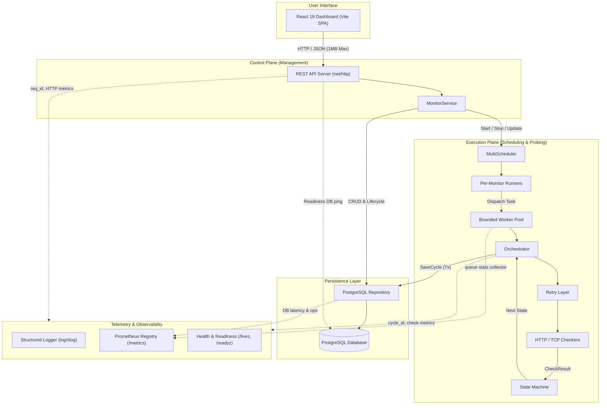
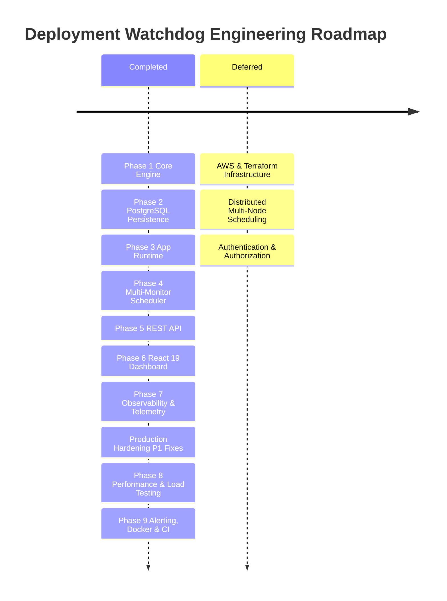

# Deployment Watchdog

A high-reliability, self-hosted endpoint monitoring and runtime observability system written in Go, backed by PostgreSQL, with a modern React 19 management dashboard.

---

## Overview

Modern software deployments frequently suffer from silent outages: portfolio sites return 404s after silent DNS changes, databases hang on exhausted connection pools, or background workers fail without triggering immediate alerts.

**Deployment Watchdog** provides continuous, deterministic uptime verification for HTTP and TCP services. It runs a recurring execution engine with bounded worker concurrency, handles transient failures via jittered exponential backoff, records health state transitions, persists complete check execution history in PostgreSQL, and exposes control through a REST API and a dense, responsive React management dashboard. The system incorporates comprehensive runtime observability with structured logging, deep health/readiness probes, and Prometheus metric instrumentation.

---

## Current Status

* **Completed Phases & Hardening**:
  * **Phase 1**: Core monitoring engine
  * **Phase 2A**: PostgreSQL schema and migrations
  * **Phase 2B**: Repository layer
  * **Phase 2C**: Persistence and orchestrator integration
  * **Phase 3**: Application runtime
  * **Phase 4A**: Recurring scheduler
  * **Phase 4B**: Bounded worker pool and persistence alignment
  * **Phase 4C**: Multi-monitor scheduling
  * **Phase 5**: REST API and runtime lifecycle management
  * **Phase 6**: React management dashboard
  * **Phase 6.1**: UI polish and documentation updates
  * **Phase 7A**: Structured logging with `log/slog`
  * **Phase 7B**: Health (`/livez`) and readiness (`/readyz`) endpoints
  * **Phase 7C**: Prometheus metrics foundation with isolated registry
  * **Phase 7D**: Subsystem instrumentation (scheduler, worker pool, checker, retry, API, DB)
  * **Phase 7E**: End-to-end observability verification
  * **Production Hardening**: Production hardening audit and concrete P1 fixes (probe timeout enforcement, request-body limits, and regression suites)
  * **Phase 8**: Performance & load testing (empirical baselines established across all 11 performance surfaces, independently audited benchmark suite isolated under `test/benchmark/`)
  * **Phase 9 (Final Credibility Pass)**:
    * **Alerting**: Webhook-based notification on monitor transitions into `UNHEALTHY` (non-fatal, bounded, strictly transition-based)
    * **Dockerization**: Multi-stage, non-root `Dockerfile` and `docker-compose.yml` for unified Watchdog and PostgreSQL orchestration
    * **CI/CD**: GitHub Actions workflow validating backend (Go tests + race detector) and frontend (Vitest + typecheck + build)
* **Deferred / Not Yet Implemented**:
  * AWS / Terraform production deployment is **not** implemented.
  * Multi-node distributed scheduling is **not** implemented.
  * Authentication & authorization are **not** implemented.

---

## Core Features

* **HTTP Health Checks**: Probes HTTP/HTTPS targets with configurable verbs (`GET`, `POST`, `PUT`, `HEAD`, `DELETE`, `PATCH`), expected status code matching (single code or ranges such as `200-299`), bounded 1 MB response-body reading, and millisecond-level latency measurement.
* **TCP Connectivity Checks**: Connects to raw `host:port` targets to verify network reachability, socket handshakes, and transport availability.
* **Network Probe Timeout Enforcement**: Both HTTP and TCP checkers derive a bounded execution context from `m.Timeout`, guaranteeing that network probes never hang indefinitely even when invoked with a background or unbounded parent context.
* **API Request-Body Limits**: Mutating API endpoints (`POST /monitors`, `PATCH /monitors/{id}`) enforce a strict 1 MB body limit via `http.MaxBytesReader` to guard against memory exhaustion and oversized payloads.
* **Bounded Retry Engine**: Retries failed attempts with exponential backoff and randomized jitter before recording a confirmed failure, aborting immediately on context cancellation or domain configuration errors.
* **State Machine Evaluation**: Maintains authoritative health state (`UNKNOWN`, `HEALTHY`, `UNHEALTHY`) with explicit, deterministic transition rules.
* **Transactional PostgreSQL Persistence**: Atomic state updates and check result insertions executed within database transactions.
* **Per-Monitor Independent Runners**: Each active monitor operates on its own recurring schedule without cross-monitor blocking or overlapping checks.
* **Bounded Worker Pool Concurrency**: Configurable global worker pool prevents socket exhaustion and system overload during multi-monitor fan-out.
* **Runtime Lifecycle Management**: Dynamically create, edit, enable/pause, and delete monitors at runtime without restarting the server.
* **REST API**: Built with Go standard library `net/http` pattern matching, offering structured JSON error envelopes, status mapping, and request-body bounds.
* **React Management Dashboard**: Vite + React 19 + TypeScript SPA with live health summary cards, responsive tabular views, inline controls, and check history inspection.
* **Dynamic Polling**: Automatic UI synchronization that adapts to each monitor's configured interval while pausing background network activity when browser tabs are hidden.
* **Structured Logging**: Built-in Go standard library `log/slog` logging with configurable levels (`DEBUG`, `INFO`, `WARN`, `ERROR`), output formats (`text`, `json`), and context correlation (`req_id`, `cycle_id`, `monitor_id`).
* **Health & Readiness Probes**: Shallow deterministic liveness probe (`GET /livez`) and deep dependency-aware readiness probe (`GET /readyz`) with graceful shutdown draining and bounded database ping timeouts.
* **Prometheus Metrics**: Isolated application registry exposing runtime metrics (`GET /metrics`) covering checks, retries, cycle errors, HTTP API calls, DB operations, active monitors, and dynamic worker pool queue stats with strict bounded label cardinality.
* **State-Transition Alerting**: Emits structured JSON webhook notifications strictly upon transitions into `UNHEALTHY` (`UNKNOWN -> UNHEALTHY`, `HEALTHY -> UNHEALTHY`). Webhook delivery failures are completely non-fatal, bounded by strict timeouts, and never impact core monitoring or state persistence.
* **Docker Containerization**: Multi-stage, non-root Alpine Docker container and Docker Compose configuration orchestrating Watchdog alongside PostgreSQL with health checks.
* **Continuous Integration (CI)**: GitHub Actions workflow executing unit/integration tests, race detector verification (`go test -race`), and frontend typechecking and production bundling on every push and pull request.
* **Race & Concurrency Safe**: Verified with the Go race detector (`go test -race -count=1 ./...`).

---

## Architecture

Deployment Watchdog organizes execution and data flow across four cohesive planes: **Control Plane (Management)**, **Execution Plane (Scheduling & Checking)**, **Persistence Layer**, and **Telemetry / Observability Plane**.


```mermaid
flowchart TD
    subgraph UI ["User Interface"]
        Vite["React 19 Dashboard (Vite SPA)"]
    end

    subgraph ControlPlane ["Control Plane (Management)"]
        API["REST API Server (net/http)"]
        Svc["MonitorService"]
    end

    subgraph ExecutionPlane ["Execution Plane (Scheduling & Probing)"]
        Sched["MultiScheduler"]
        Runner["Per-Monitor Runners"]
        Pool["Bounded Worker Pool"]
        Orch["Orchestrator"]
        Retry["Retry Layer"]
        Checkers["HTTP / TCP Checkers"]
        StateMach["State Machine"]
    end

    subgraph Persistence ["Persistence Layer"]
        Repo["PostgreSQL Repository"]
        DB[("PostgreSQL Database")]
    end

    subgraph Telemetry ["Telemetry & Observability"]
        Slog["Structured Logger (log/slog)"]
        Metrics["Prometheus Registry (/metrics)"]
        Probes["Health & Readiness (/livez, /readyz)"]
    end

    Vite -->|"HTTP / JSON (1MB Max)"| API
    API --> Svc
    Svc -->|"CRUD & Lifecycle"| Repo
    Svc -->|"Start / Stop / Update"| Sched
    Sched --> Runner
    Runner -->|"Dispatch Task"| Pool
    Pool --> Orch
    Orch --> Retry
    Retry --> Checkers
    Checkers -->|"CheckResult"| StateMach
    StateMach -->|"Next State"| Orch
    Orch -->|"SaveCycle (Tx)"| Repo
    Repo --> DB

    API -.->|"req_id, HTTP metrics"| Telemetry
    Orch -.->|"cycle_id, check metrics"| Telemetry
    Pool -.->|"queue stats collector"| Metrics
    Repo -.->|"DB latency & ops"| Metrics
    API -.->|"Readiness DB ping"| DB
```

### Architectural Flow

$$\text{Frontend} \longrightarrow \text{REST API} \longrightarrow \text{MonitorService} \longrightarrow \text{Repository / SchedulerController} \longrightarrow \text{MultiScheduler} \longrightarrow \text{Bounded WorkerPool} \longrightarrow \text{Retry Layer} \longrightarrow \text{HTTP/TCP Checker} \longrightarrow \text{State Transition} \longrightarrow \text{PostgreSQL Persistence} \longrightarrow \text{Telemetry}$$

1. **Control Plane**: Handlers limit incoming request bodies to 1 MB, deserialize payloads, enforce domain validation, and invoke `MonitorService`. `MonitorService` coordinates repository persistence with `MultiScheduler` lifecycle methods (`StartMonitor`, `StopMonitor`, `UpdateMonitor`), maintaining consistency through compensating rollbacks if downstream scheduling operations fail.
2. **Execution Plane**: The `MultiScheduler` manages an independent `Runner` goroutine for each active monitor. Each runner enforces fixed-delay scheduling (next cycle begins strictly after `interval_ms` following completion of the prior cycle, preventing overlapping checks). Runners enqueue execution tasks into a global `WorkerPool` bounded by a fixed concurrency ceiling. The assigned worker invokes the `Orchestrator`, which executes the `Retry` layer, triggers the target `Checker`, evaluates health state transitions via the state machine, and persists results.
3. **Persistence Layer**: Encapsulated behind the `persistence.Repository` interface with a PostgreSQL implementation using atomic transactional guarantees for monitor state transitions and append-only check history.
4. **Telemetry / Observability Plane**: A thread-safe, non-intrusive telemetry layer records structured logs (`log/slog`), provides shallow liveness and deep readiness verification, and instruments all application subsystems via an isolated Prometheus metrics registry.

---

## Technology Stack

### Backend
* **Language**: Go 1.26.5
* **HTTP Routing & Server**: Go Standard Library `net/http` (Go 1.22+ ServeMux routing)
* **Database Driver**: `github.com/jackc/pgx/v5` (`stdlib`)
* **Logging**: Go Standard Library `log/slog`
* **Metrics**: `github.com/prometheus/client_golang` (isolated application registry)
* **Concurrency Primitives**: Go channels, `sync.Mutex`, `sync.RWMutex`, `sync.WaitGroup`, `sync/atomic`, `context.Context`

### Database
* **Engine**: PostgreSQL 14+
* **Migrations**: Versioned SQL schema files (`migrations/`)

### Frontend
* **UI Framework**: React 19 + TypeScript
* **Build Tool & Dev Server**: Vite 6
* **Styling**: Tailwind CSS v4
* **Server State & Caching**: TanStack Query v5 (`@tanstack/react-query`)
* **Client-Side Routing**: React Router v7 (`react-router-dom`)
* **Icons**: Lucide React

---

## Project Structure

```
Deployment WatchDog/
├── cmd/
│   └── watchdog/                   # Application entrypoint (signal handling, wiring, runtime execution)
├── internal/
│   ├── api/                        # REST API handlers, routing, JSON models, health probes, and HTTP server
│   ├── checker/                    # HTTP and TCP probing engines, timeout enforcement, CheckResult definitions
│   ├── monitor/                    # Core monitor domain entity and protocol kind definitions
│   ├── persistence/                # Repository interface specifications
│   │   └── postgres/               # PostgreSQL repository implementation, transactional queries, E2E tests
│   ├── retry/                      # Retry executor with exponential backoff and jitter
│   ├── scheduler/                  # MultiScheduler, per-monitor Runner, and execution Orchestrator
│   ├── service/                    # MonitorService business logic and scheduler lifecycle reconciliation
│   ├── state/                      # Health state machine and transition logic
│   ├── telemetry/                  # Structured logging (log/slog), Prometheus metrics, context correlation
│   └── worker/                     # Bounded worker concurrency pool and dynamic stats provider
├── migrations/
│   ├── 001_initial_schema.up.sql   # Core tables: monitors, monitor_states, check_results
│   ├── 001_initial_schema.down.sql
│   ├── 002_monitor_scheduling_fields.up.sql # Adds interval_ms, timeout_ms, and enabled
│   └── 002_monitor_scheduling_fields.down.sql
└── web/                            # React 19 + TypeScript SPA
    ├── src/
    │   ├── api/                    # Typed fetch client and endpoint functions
    │   ├── components/             # Reusable UI elements (Badges, Cards, Modals, Tables)
    │   ├── hooks/                  # React Query hooks (useMonitors, useMonitorDetail, useMonitorMutations)
    │   ├── test/                   # Vitest unit and component tests
    │   ├── types/                  # TypeScript domain types mirroring Go backend structs
    │   ├── utils/                  # Duration formatters, timestamp helpers, and validation rules
    │   └── views/                  # DashboardView, MonitorDetailView, NotFoundView
    ├── package.json
    ├── tsconfig.json
    └── vite.config.ts
```

---

## Monitoring Model & Network Probing

Every monitor defines a recurring check against a specific network target:

### HTTP Checks
* **Target**: Valid `http://` or `https://` URL with a resolvable host.
* **Method**: `GET`, `POST`, `PUT`, `HEAD`, `DELETE`, `PATCH` (defaults to `GET`).
* **Expected Status**: Single code (e.g. `200`) or range (e.g. `200-299`).
* **Stream Bounds**: Prober response bodies are capped at 1 MB via `io.LimitReader` and drained to allow HTTP keep-alive connection reuse without unbounded memory consumption.
* **Error Classification**: Identifies root failure causes such as `dns`, `conn_refused`, `tls`, `timeout`, or `status`.

### TCP Checks
* **Target**: `host:port` address (e.g. `127.0.0.1:5432`, `db.internal:3306`).
* **Protocol Rule**: Verifies standard TCP socket handshake completion. HTTP-specific fields (`method`, `expected_status_range`) are omitted.
* **Error Classification**: Categorizes connection refusals, timeouts, and DNS resolution failures.

### Network Probe Timeout Enforcement
In both `HTTPChecker` and `TCPChecker`, network operations derive a bounded execution context from `m.Timeout`:
```go
checkCtx := ctx
if m.Timeout > 0 {
    var cancel context.CancelFunc
    checkCtx, cancel = context.WithTimeout(ctx, m.Timeout)
    defer cancel()
}
```
This guarantees that slow DNS queries, stalled TCP handshakes, or hanging HTTP responses are cancelled deterministically when the monitor's configured timeout is reached, even if the parent caller passed an unbounded context.

### Check Results & State Evaluation
Each completed monitoring cycle produces an immutable `CheckResult`:
* `ok`: Boolean indicating pass or fail.
* `latency`: Duration taken for the check cycle to complete.
* `status_code`: HTTP status code when present; omitted on TCP or connection-level failures.
* `attempt_count`: Number of probe attempts made during the retry cycle.
* `error_class` / `error_detail`: Category and detail message for failures.

Health state is tracked separately in `monitor_states` and transitions deterministically based on cycle results:
* `UNKNOWN` $\rightarrow$ Initial state until the first check cycle finishes.
* `HEALTHY` $\rightarrow$ Confirmed active after a successful check.
* `UNHEALTHY` $\rightarrow$ Declared after probe failures persist through the retry cycle.

---

## Retry Behavior

Transient network blips should not trigger false alarms. Deployment Watchdog incorporates an internal retry loop before recording a failed cycle:

* **Bounded Attempts**: Up to 3 attempts per cycle.
* **Exponential Backoff**: Increasing delay between attempts, starting from a 100ms base delay and capped at the configured maximum.
* **Randomized Jitter**: Prevents synchronized retry storms across concurrent checks.
* **Cancellation Awareness**: If the monitor's overall timeout expires or the server initiates a shutdown, retries abort immediately.
* **Execution Errors vs Target Failures**: Domain configuration errors (e.g. malformed URLs) fail immediately without wasteful retries.

---

## Scheduler / Worker Pool

1. **Per-Monitor Runners**: Each enabled monitor receives a dedicated background `Runner` goroutine.
2. **Fixed-Delay Scheduling**: Next cycle begins strictly after the configured `interval_ms` following the completion of the prior cycle, guaranteeing **no overlapping checks for the same monitor**.
3. **Bounded Concurrency**: Individual runners do not execute network checks directly; instead, they queue an execution task into the worker `Pool`.
4. **Global Concurrency Ceiling**: The pool maintains a bounded number of worker goroutines (`WATCHDOG_WORKER_CONCURRENCY`, default 5), protecting local and target resources against socket exhaustion.
5. **Dynamic Stats Inspection**: The worker pool exposes active worker count, pending queue depth, and configured capacity to the Prometheus metrics collector.

---

## Persistence

Deployment Watchdog uses PostgreSQL with explicit schema definitions:

```sql
-- monitors: Stores target configuration
CREATE TABLE monitors (
    id UUID PRIMARY KEY,
    name TEXT NOT NULL,
    kind TEXT NOT NULL,
    target TEXT NOT NULL,
    method TEXT NULL,
    expected_status_range TEXT NULL,
    interval_ms BIGINT NOT NULL DEFAULT 60000 CHECK (interval_ms > 0),
    timeout_ms BIGINT NOT NULL DEFAULT 5000 CHECK (timeout_ms > 0),
    enabled BOOLEAN NOT NULL DEFAULT true,
    created_at TIMESTAMPTZ NOT NULL DEFAULT NOW(),
    updated_at TIMESTAMPTZ NOT NULL DEFAULT NOW()
);

-- monitor_states: Stores authoritative health state (1:1 with monitors)
CREATE TABLE monitor_states (
    monitor_id UUID PRIMARY KEY REFERENCES monitors(id) ON DELETE CASCADE,
    state TEXT NOT NULL,
    updated_at TIMESTAMPTZ NOT NULL DEFAULT NOW()
);

-- check_results: Append-only execution history (1:N with monitors)
CREATE TABLE check_results (
    id BIGSERIAL PRIMARY KEY,
    monitor_id UUID NOT NULL REFERENCES monitors(id) ON DELETE CASCADE,
    ok BOOLEAN NOT NULL,
    status_code INTEGER NULL,
    latency_ms BIGINT NOT NULL CHECK (latency_ms >= 0),
    error_class TEXT NULL,
    error_detail TEXT NULL,
    attempt_count INTEGER NOT NULL CHECK (attempt_count > 0),
    checked_at TIMESTAMPTZ NOT NULL
);
CREATE INDEX idx_check_results_monitor_checked_at ON check_results (monitor_id, checked_at DESC);
```

### Transactional Guarantees
* **Creation**: Inserting a monitor and its initial `UNKNOWN` state occurs in a single database transaction.
* **Execution**: Recording a `CheckResult` and updating the `monitor_states` row occurs atomically in a transaction at the end of each cycle.
* **Deletion**: Foreign keys use `ON DELETE CASCADE`, ensuring check results and states are cleaned up atomically.

---

## REST API

All API routes are rooted at `/`:

| Method | Route | Description | Success Code |
|---|---|---|---|
| `POST` | `/monitors` | Create a new monitor and schedule it if enabled (1 MB body limit) | `201 Created` |
| `GET` | `/monitors` | List all configured monitors | `200 OK` |
| `GET` | `/monitors/{id}` | Retrieve monitor configuration by UUID | `200 OK` |
| `PATCH` | `/monitors/{id}` | Update monitor fields (kind is immutable; 1 MB body limit) | `200 OK` |
| `DELETE` | `/monitors/{id}` | Stop runner and delete monitor from database | `204 No Content` |
| `GET` | `/monitors/{id}/status` | Retrieve current health state and timestamp | `200 OK` |
| `GET` | `/monitors/{id}/checks` | Get recent check results history (`?limit=N`, max 100) | `200 OK` |
| `GET` | `/livez` | Shallow liveness probe (returns 200 without external I/O) | `200 OK` |
| `GET` | `/readyz` | Deep readiness probe (checks draining state, scheduler state, and 1s DB ping) | `200 OK` / `503 Service Unavailable` |
| `GET` | `/metrics` | Prometheus metrics exposition in text format (version=0.0.4) | `200 OK` |

### Error Format
All errors return a standard JSON envelope:
```json
{
  "error": {
    "code": "INVALID_ARGUMENT",
    "message": "interval_ms must be at least 1000ms",
    "details": null
  }
}
```

When an incoming request body exceeds 1 MB or contains malformed JSON, the server responds with HTTP 400 Bad Request and the error code `MALFORMED_JSON`.

---

## Observability & Health Probes

Deployment Watchdog includes structured logging, health/readiness probes, and Prometheus-based runtime metrics for operational visibility.

### Structured Logging (`log/slog`)
* Emits structured log records using Go's standard library `log/slog`.
* **Configurable Log Level**: Set via `WATCHDOG_LOG_LEVEL` (`DEBUG`, `INFO`, `WARN`, `ERROR`; defaults to `INFO`).
* **Configurable Output Format**: Set via `WATCHDOG_LOG_FORMAT` (`text`, `json`; defaults to `text`).
* **Context Correlation**:
  * HTTP API requests are tagged with `req_id` (propagated via `telemetry.WithRequestID`).
  * Monitoring execution cycles are tagged with `cycle_id` and `monitor_id` (propagated via `telemetry.WithCycleContext`).
  * Log records include standardized `component` attributes (`api`, `scheduler`, `orchestrator`, `retry`, `checker`, `worker`, `persistence`, `telemetry`).

### Health & Readiness Probes
* **Liveness Probe (`GET /livez`)**:
  * Shallow and deterministic.
  * Confirms the HTTP server is alive and responding.
  * Performs **zero external I/O** (does not touch the database, network, or scheduler).
* **Readiness Probe (`GET /readyz`)**:
  * Deep check verifying whether the service is ready to handle traffic.
  * **Graceful Shutdown Awareness**: Checks draining state first. If the application has initiated shutdown (`DrainTracker.IsDraining()`), it returns `503 Service Unavailable` immediately without invoking downstream dependencies.
  * **Scheduler State**: Verifies the scheduler loop is actively running (`SchedulerHealthChecker.IsRunning()`).
  * **Database Ping**: Performs a bounded database ping with a strict **1-second timeout** (`context.WithTimeout(ctx, 1*time.Second)`). Database error strings are sanitized to prevent credential leakage in logs.
  * Returns `200 OK` ("ready") when all checks pass, or `503 Service Unavailable` ("not ready") if draining, scheduler halted, or DB ping fails.

### Prometheus Metrics Foundation
The metrics subsystem uses Prometheus Go client (`github.com/prometheus/client_golang`) with an **isolated application registry** (`prometheus.NewRegistry()`) rather than the shared global default registry:

| Metric Name | Type | Labels | Description |
|---|---|---|---|
| `watchdog_monitors_active` | Gauge | `kind` | Number of active runner goroutines managing schedules |
| `watchdog_checks_total` | Counter | `kind`, `status`, `error_class` | Total check cycles completed |
| `watchdog_check_duration_seconds` | Histogram | `kind`, `status` | End-to-end check latency in seconds |
| `watchdog_check_retries_total` | Counter | `kind`, `outcome` | Total retry attempts triggered after transient failures |
| `watchdog_scheduler_cycle_errors_total` | Counter | `stage` | Unhandled cycle failures in runner loops |
| `watchdog_http_requests_total` | Counter | `method`, `route`, `status_code` | Total HTTP API requests handled |
| `watchdog_http_request_duration_seconds` | Histogram | `method`, `route` | Latency of HTTP API requests in seconds |
| `watchdog_db_operations_total` | Counter | `operation`, `status` | Total database queries and transactions |
| `watchdog_db_operation_duration_seconds` | Histogram | `operation` | Latency of database calls in seconds |
| `watchdog_worker_pool_active_workers` | Gauge | *(none)* | Dynamically collected count of workers executing checks |
| `watchdog_worker_pool_queued_jobs` | Gauge | *(none)* | Dynamically collected queue depth awaiting workers |
| `watchdog_worker_pool_capacity` | Gauge | *(none)* | Configured concurrency capacity ceiling of the worker pool |

### Cardinality Safeguards
To eliminate the risk of high-cardinality label explosions and memory exhaustion:
* **No dynamic identifiers as metric labels**: `monitor_id`, `cycle_id`, and `req_id` are strictly prohibited from Prometheus metric labels.
* **No unbounded text as metric labels**: Raw target URLs and error detail strings are never recorded as metric labels.
* Label sets are restricted to bounded, finite enumerations: `kind` (`http`, `tcp`), `status` (`success`, `failure`), `error_class` (`dns`, `conn_refused`, `tls`, `timeout`, `status`, `none`), HTTP `route` templates (e.g. `/monitors/{id}`), and DB operations (`save_cycle`, `get_monitor`, etc.).
* Dynamic identifiers and detailed error strings remain exclusively in structured log entries.

---

## Production Hardening

A production hardening audit identified two P1 failure modes that have been resolved and verified with dedicated regression tests:

### 1. Network Probe Timeout Enforcement
* **Problem**: Previously, if a caller passed a `context.Background()` or context without a deadline to `HTTPChecker.Check` or `TCPChecker.Check`, a stalled TCP dial or hung HTTP connection could block indefinitely, occupying worker pool capacity and starving other checks.
* **Fix**: Both `HTTPChecker` and `TCPChecker` now inspect `m.Timeout`. If `m.Timeout > 0`, the checker derives a bounded execution context (`context.WithTimeout(ctx, m.Timeout)`) and passes it into `http.NewRequestWithContext` and `c.dialer.DialContext`.
* **Result**: Hung network sockets are terminated deterministically when the monitor's configured timeout expires.
* **Regression Coverage**:
  * `TestHTTPChecker_EnforcesMonitorTimeout` in `internal/checker/http_test.go`
  * `TestTCPChecker_EnforcesMonitorTimeout` in `internal/checker/tcp_test.go`

### 2. API Request-Body Limits
* **Problem**: Handlers for `POST /monitors` (`CreateMonitor`) and `PATCH /monitors/{id}` (`PatchMonitor`) read request bodies directly into `json.NewDecoder(r.Body)` without an upper size bound. A client could send multi-megabyte payloads, triggering server memory pressure or DoS conditions.
* **Fix**: Request bodies for mutating endpoints are now wrapped with `r.Body = http.MaxBytesReader(w, r.Body, 1024*1024)` before JSON decoding.
* **Result**: Payloads exceeding 1 MB are rejected with HTTP 400 Bad Request and error code `MALFORMED_JSON`.
* **Regression Coverage**:
  * `TestAPI_OversizedRequestBodyRejected` in `internal/api/server_test.go`

---

## Performance & Scale

The system's empirical performance baselines were established during Phase 8 using an isolated, independently audited benchmark suite (`test/benchmark/`) operating against local deterministic infrastructure and an ephemeral PostgreSQL 17 instance.

### Tested Workload Envelope
* **Monitors Tested**: Up to 500 active monitors.
* **Worker Concurrency Tested**: Evaluated across 1, 5, 10, 25, and 50 workers.
* **No P0/P1 Bottlenecks**: No correctness failures, data corruption, or system halts were observed within the tested workload and scale envelope.

### Measured Benchmark Baselines

* **HTTP Checker**:
  * Fast 200 OK response: approximately 60 µs average latency (~37–60 µs range).
  * Failed 500 status response: approximately 42 µs average latency.
  * Fast-path throughput: roughly 16,000+ ops/s in the tested workload.
  * Timeout enforcement: a 40 ms monitor timeout against a 200 ms slow target was enforced at approximately 40.5 ms with `ErrorClass: timeout`.
* **TCP Checker**:
  * Successful connection: approximately 70 µs average latency.
  * Refused connection: approximately 25 µs average latency (`ErrorClass: conn_refused`).
  * Timeout enforcement: a 40 ms monitor timeout was enforced at approximately 41 ms.
* **Retry Layer**:
  * First-attempt success overhead: approximately 44 ns per invocation with 0 allocations in the measured path.
  * Three-attempt failure and context cancellation during backoff were verified to abort cleanly.
* **Worker Pool Concurrency & Throughput**:
  * Concurrency scaling (under tested 2 ms simulated work):
    * 1 worker: approximately 437 jobs/s (571 ms average latency)
    * 5 workers: approximately 2,174 jobs/s (111 ms average latency)
    * 10 workers: approximately 4,382 jobs/s (57 ms average latency)
    * 25 workers: approximately 11,217 jobs/s (23 ms average latency)
    * 50 workers: approximately 22,199 jobs/s (11 ms average latency)
  * Same-monitor serialization: verified that concurrent submissions for the same monitor ID maintain a peak concurrency of strictly 1.
  * Multi-monitor concurrency: verified that submissions for distinct monitors execute in parallel.
* **MultiScheduler Scaling**:
  * Tested at 10, 50, 100, 250, and 500 monitors with one runner goroutine per monitor.
  * Memory usage: at 500 monitors, benchmark memory usage was approximately 7.3 MB heap allocation.
  * Throughput: reached roughly 3,800 cycles/s under an aggressive 50 ms test interval against a 25-worker pool. *(Note: this 50 ms interval represents an artificial stress workload, not a normal production monitor configuration).*
* **PostgreSQL Persistence**:
  * Sequential `SaveCycle`: approximately 142 µs average latency (~7,035 ops/s).
  * Concurrent `SaveCycle`: throughput reached approximately 15,000 ops/s across 5–10 concurrent workers; at 50 concurrent writers, average latency was approximately 4.25 ms (p95 ~22.3 ms).
  * Read operations: `GetState` averaged approximately 27 µs; `ListCheckResults` (limit 10) averaged approximately 56 µs.
  * Connection pool stats: no connection-pool waiting (`WaitCount: 0`, `WaitDuration: 0s`) was observed under tested local workloads using Go's default `database/sql` configuration.
* **REST API Endpoints**:
  * `GET /monitors` scaling: 10 monitors (102 µs, 2.9 KB), 100 monitors (262 µs, 29.6 KB), 500 monitors (931 µs, 148 KB).
  * Single-resource endpoints: `GET /monitors/{id}` (~137 µs), `GET /monitors/{id}/status` (~143 µs), `GET /monitors/{id}/checks` (~184 µs), `POST /monitors` (~286 µs), `PATCH /monitors/{id}` (~253 µs).
* **Frontend N+1 Dashboard Simulation**:
  * Tested pattern: 1 list request followed by $N$ concurrent status requests.
  * At 500 monitors (501 HTTP requests, ~1,501 database queries), total dashboard load was approximately 269 ms on local loopback. *(Note: this is a local loopback measurement and does not represent a WAN performance guarantee; remote browser connection limits introduce latency over network hops).*
* **Observability Overhead**:
  * Metric recording: measured approximately 95–123 ns per invocation with zero heap allocations in the measured path (`RecordCheck` ~107–117 ns, `RecordHTTPRequest` ~123 ns, `RecordDBOperation` ~95 ns).
  * Structured logging: `slog.Info` in JSON format measured approximately 574 ns per log line.
  * In database persistence cycles, telemetry recording overhead accounted for less than 0.1% of total transaction duration.
* **Resource Stability**:
  * A 3-second scheduler sampling test under 50 monitors at 100 ms intervals showed bounded heap allocations (~1.3–1.8 MB) and goroutines returning near baseline upon graceful shutdown. No obvious resource leaks were observed in the tested workload.
  * All 12 Prometheus metric families were verified through `/metrics`.

---

## Frontend

The frontend is a dedicated Single Page Application in `web/`:

* **Dashboard (`/`)**:
  * **Summary Metrics**: Total monitors, Healthy (green), Unhealthy (red), Unknown (zinc), and Paused (amber).
  * **Filter Bar**: Text search across name and target, protocol filter (All / HTTP / TCP), and status filter.
  * **Monitor Table**: Displays endpoint name, target, protocol badge, health state, relative update timestamp, interval/timeout, optimistic active toggle, and action controls.
  * **Empty States**: Contextual messages distinguishing between an unconfigured system and zero matching filter results.
* **Detail Page (`/monitors/:id`)**:
  * Header with breadcrumbs, target URL, protocol badge, and live health status badge.
  * Configuration card detailing all probe parameters.
  * Live-polling recent checks table with pass/fail indicators, response codes, latency (ms), retry counts, and expandable error tracebacks.
  * Limit switcher supporting 10, 20, 50, or 100 entries.
* **Create & Edit Modal**:
  * Dynamically switches fields between HTTP and TCP.
  * Locks protocol `kind` in Edit mode to enforce backend immutability rules.
  * Displays backend rejection reasons in a form-level error banner while preserving user input.
* **Optimistic Updates**: Toggling enable/disable immediately updates the UI toggle, rolling back to snapshot state if the API request fails.
* **Polling Strategy**: 30-second polling on the dashboard; dynamic polling on the detail page tied to the monitor's check interval:
  $$\text{pollInterval} = \max(10\,000\text{ ms},\; \min(\text{monitor.interval\_ms},\; 60\,000\text{ ms}))$$
* **Resource Conservation**: Polling automatically pauses when the browser tab is hidden (`document.visibilityState === 'hidden'`).

---

## Local Development

### Prerequisites
* Go 1.22+ (tested with Go 1.26.5)
* PostgreSQL 14+
* Node.js 18+ and npm

### 1. Database Setup
Create a PostgreSQL database and apply schema migrations:

```bash
# Create database
createdb watchdog

# Run schema migrations in order
psql -d watchdog -f migrations/001_initial_schema.up.sql
psql -d watchdog -f migrations/002_monitor_scheduling_fields.up.sql
```

### 2. Start the Backend Server
Configure environment variables and run the Go server:

```bash
# Configure connection URL (adjust credentials as needed)
export WATCHDOG_DATABASE_URL="postgres://localhost:5432/watchdog?sslmode=disable"
export WATCHDOG_HTTP_PORT=":8080"
export WATCHDOG_WORKER_CONCURRENCY=5
export WATCHDOG_LOG_LEVEL="INFO"        # DEBUG, INFO, WARN, ERROR
export WATCHDOG_LOG_FORMAT="text"       # text, json
export WATCHDOG_ALERT_WEBHOOK_URL=""     # Optional generic webhook URL (e.g. Slack incoming webhook)

# Start backend
go run ./cmd/watchdog
```

The server listens on `http://localhost:8080`.

### 3. Start the Frontend Application
In a separate terminal, install dependencies and launch the Vite development server:

```bash
cd web
npm install
npm run dev
```

The dashboard opens on `http://localhost:5173`. Vite's development proxy automatically routes API calls to `http://localhost:8080`.

### Alternative: Run with Docker Compose
To launch both the PostgreSQL database and Watchdog in isolated containers with health checks:

```bash
# Start Watchdog and PostgreSQL
docker compose up -d

# Check service logs
docker compose logs -f watchdog
```

---

## Testing

The project incorporates end-to-end verification across multiple testing layers:

### Backend Unit & Integration Tests
Run the complete Go test suite:
```bash
go test ./...
```

Run with the Go race detector to verify concurrency safety under load:
```bash
go test -race -count=1 ./...
```

### Observability End-to-End Suite
Verify integrated telemetry, metrics exposition, health probes, and graceful shutdown draining against a live database:
```bash
go test -v -run TestE2E_ObservabilityAndShutdown ./internal/persistence/postgres/...
```

### Production Hardening Regression Tests
Run the specific regression test suite for probe timeouts and request-body limits:
```bash
go test -v -run "TestHTTPChecker_EnforcesMonitorTimeout|TestTCPChecker_EnforcesMonitorTimeout" ./internal/checker/...
go test -v -run TestAPI_OversizedRequestBodyRejected ./internal/api/...
```

### Performance & Benchmark Suite
Run the isolated Phase 8 benchmark suite:
```bash
# Run all benchmark tests and scaling assertions
go test -v ./test/benchmark/...

# Run micro-benchmarks with memory allocation profiling
go test -bench=. -benchmem ./test/benchmark/...
```

### Frontend Test Suite
Run TypeScript static analysis, Vitest component/unit tests, and production asset bundling:
```bash
cd web

# 1. TypeScript typecheck
npm run typecheck

# 2. Vitest unit and component tests
npm test

# 3. Production bundle build
npm run build
```

---

## Alerting & Webhooks

Deployment Watchdog includes a generic webhook notifier that delivers immediate operational notifications when monitors fail.

### State-Transition Semantics
To prevent notification storms, alerts are emitted **strictly upon transitions into `UNHEALTHY`**:

| Transition | Emits Outage Alert? | Rationale |
|---|---|---|
| `UNKNOWN -> HEALTHY` | No | Initial successful discovery |
| `UNKNOWN -> UNHEALTHY` | **Yes** | Monitor immediately discovered in failure state |
| `HEALTHY -> HEALTHY` | No | Normal continuous operation |
| `HEALTHY -> UNHEALTHY` | **Yes** | Outage detected |
| `UNHEALTHY -> UNHEALTHY` | **No** | Steady-state failure; no alert spam on repeated failed cycles |
| `UNHEALTHY -> HEALTHY` | No | Recovery (outage resolved) |
| `HEALTHY -> UNKNOWN` | No | No outage transition |

Alerts are decoupled from retry attempts: retries are exhausted first, and only the resulting state transition triggers an alert.

### Webhook Configuration
Alerting is configured via the environment variable:
```bash
export WATCHDOG_ALERT_WEBHOOK_URL="https://hooks.slack.com/services/T00/B00/X123"
```
* **Optional & Non-Breaking**: If `WATCHDOG_ALERT_WEBHOOK_URL` is empty or unset, alerting is disabled and monitoring continues normally.
* **Failure Isolation**: Alert delivery is completely non-fatal. If the webhook endpoint returns a non-2xx status, network error, or times out, the failure is logged and recorded in metrics (`watchdog_scheduler_cycle_errors_total{stage="alert"}`), but the check result and state transition remain saved in PostgreSQL. The scheduler never crashes or blocks.
* **Bounded Timeout**: Webhook requests enforce a strict 5-second timeout and bounded response-body drain to prevent worker goroutine stalls.

### Payload Schema
The webhook delivers a stable JSON payload:
```json
{
  "event": "monitor_unhealthy",
  "monitor": {
    "id": "0194eb12-789a-7b3e-8fa9-994dc15f4012",
    "name": "Production API",
    "kind": "http",
    "target": "https://api.example.com/health"
  },
  "transition": {
    "from": "HEALTHY",
    "to": "UNHEALTHY"
  },
  "check": {
    "ok": false,
    "status_code": 503,
    "error_class": "status",
    "error_detail": "upstream service unavailable",
    "attempt_count": 3,
    "latency_ms": 142
  },
  "timestamp": "2026-10-03T19:30:00Z"
}
```

### Security & Sanitization
* **Credential Stripping**: Userinfo credentials (`user:password@host`) embedded within target URLs are automatically stripped prior to webhook dispatch.
* **Bounded Error Details**: Error descriptions are truncated to 256 characters and stripped of control characters.
* **Credential Concealment**: Webhook URLs and authorization tokens are never logged or leaked into application error strings.

---

## Docker & Container Deployment

Deployment Watchdog includes a production-oriented containerization setup for reproducible local execution.

### Multi-Stage Dockerfile
The `Dockerfile` employs a multi-stage Go build pattern:
* **Build Stage**: Uses `golang:1.26-alpine` to compile a statically-linked, CGO-disabled binary with stripped symbol tables (`-ldflags="-s -w"`).
* **Runtime Stage**: Uses minimal `alpine:3.21` with CA certificates and timezone data.
* **Non-Root User**: Runs under dedicated unprivileged system user `watchdog:watchdog` (UID/GID `10001`).
* **Minimal Attack Surface**: The final image contains only the compiled binary, certificates, and runtime OS files.

### Docker Compose
A unified `docker-compose.yml` orchestrates Watchdog alongside a PostgreSQL 16 database:
* **Watchdog Service**: Runs the application on port `8080` with runtime environment configuration.
* **PostgreSQL Service**: Runs PostgreSQL with a persistent named volume (`postgres_data`) and an automated `pg_isready` healthcheck.
* **Dependency Ordering**: Watchdog depends on PostgreSQL with `condition: service_healthy`, ensuring the database is accepting connections before the engine boots.

```bash
# Launch Watchdog and PostgreSQL
docker compose up -d

# Check status
docker compose ps

# View application logs
docker compose logs -f watchdog
```

---

## Continuous Integration (GitHub Actions)

Continuous integration is automated via GitHub Actions in `.github/workflows/ci.yml`. Every `push` and `pull_request` to `main` executes two parallel verification jobs:

* **Backend Job (Go)**:
  * Automatically sets up Go matching the version in `go.mod`.
  * Runs all unit, integration, and alerting test suites (`go test -v ./cmd/... ./internal/...`).
  * Runs the Go race detector across all packages (`go test -race ./cmd/... ./internal/...`) to guarantee concurrency safety.
* **Frontend Job (React / Vite)**:
  * Sets up Node.js 20 with dependency caching.
  * Runs strict dependency installation (`npm ci`).
  * Executes the Vitest unit/component suite (`npm test`).
  * Verifies static type safety with the TypeScript compiler (`npm run typecheck`).
  * Validates production asset bundling with Vite (`npm run build`).

---

## Current Limitations

The following architectural limitations represent intentional scope boundaries, stress-workload observations, or areas for future optimization:

* **PostgreSQL Connection-Pool Tuning**: Database connection pool parameters (`SetMaxOpenConns`, `SetMaxIdleConns`, `SetConnMaxLifetime`) are not currently exposed as environment variables and use driver defaults. While the benchmark suite observed zero connection-pool waiting under the tested single-instance local workloads, explicit pool limits remain relevant for multi-instance or high-concurrency production deployments.
* **Unpaginated Monitor Listing**: `GET /monitors` currently returns the full monitor catalog. In the benchmark suite, 500 monitors yielded a 148 KB payload and 931 µs response time. Keyset or offset pagination remains a future consideration as the monitor catalog grows beyond the tested scale.
* **Dashboard N+1 Status Requests**: The dashboard fetches the monitor list followed by concurrent status queries per monitor. At 500 monitors, the simulation generated 501 HTTP requests and approximately 1,501 SQL queries, completing in 269 ms on local loopback. However, over higher-latency WAN connections or in browsers with concurrent connection limits (typically 6 per domain on HTTP/1.1), this pattern increases round-trip latency. A future bulk-status endpoint (`GET /monitors/status`) can consolidate this into a single query.
* **Worker Queue Under Stress Intervals**: In a benchmark stress test using an aggressive 50 ms check interval with 500 monitors, a 25-worker pool accumulated queued jobs because incoming check requests exceeded worker capacity. For normal monitor intervals (typically 60 seconds), queue accumulation was not observed.
* **Fixed HTTP Response-Body Limit**: The HTTP checker response body read limit is currently fixed at 1 MB via `io.LimitReader`; it cannot be tuned per monitor.
* **Authentication & Authorization**: The REST API and frontend dashboard are unauthenticated (designed for protected internal networks).
* **Single-Node Runtime**: The scheduler and worker pool operate in-process within a single binary. Distributed multi-node coordination and leader election are not yet implemented.
* **No Distributed Tracing**: Observability covers structured logging and Prometheus metrics, but OpenTelemetry distributed tracing (spans, context propagation across external calls) is not implemented.
* **No Server-Push Updates**: The frontend utilizes polling rather than WebSockets or Server-Sent Events (SSE) for state synchronization.
* **Cloud Infrastructure Deferred**: AWS deployment, Lambda adaptation, and Terraform definitions are not yet implemented.

---

## Roadmap


```mermaid
timeline
    title Deployment Watchdog Engineering Roadmap
    Completed : Phase 1 Core Engine : Phase 2 PostgreSQL Persistence : Phase 3 App Runtime : Phase 4 Multi-Monitor Scheduler : Phase 5 REST API : Phase 6 React 19 Dashboard : Phase 7 Observability & Telemetry : Production Hardening P1 Fixes : Phase 8 Performance & Load Testing : Phase 9 Alerting, Docker & CI
    Deferred : AWS & Terraform Infrastructure : Distributed Multi-Node Scheduling : Authentication & Authorization
```

### Completed
* **Phase 1** — Core monitoring engine (HTTP/TCP checks, state transitions, retry loop)
* **Phase 2** — PostgreSQL persistence (schema migrations, repository layer, transactional cycles)
* **Phase 3** — Application runtime (signal handling, lifecycle wiring, graceful shutdown)
* **Phase 4** — Scheduler + worker pool (recurring fixed-delay runners, bounded concurrency, multi-monitor scheduling)
* **Phase 5** — REST API + lifecycle management (ServeMux routes, JSON error envelope, dynamic CRUD)
* **Phase 6** — React management dashboard (React 19, Vite, Tailwind CSS v4, TanStack Query, UI polish)
* **Phase 7** — Observability (structured `log/slog`, `/livez`, `/readyz`, Prometheus `/metrics`, subsystem instrumentation, cardinality controls, E2E verification)
* **Production Hardening** — Audit and concrete P1 fixes (probe timeout enforcement, 1 MB request-body limit, regression test suites)
* **Phase 8** — Performance & load testing (empirical baselines across 11 surfaces, worker scaling up to 50 workers, scheduler scaling up to 500 monitors, audited test suite in `test/benchmark/`)
* **Phase 9 (Final Credibility Pass)** — Alerting (generic webhook on transitions into UNHEALTHY, non-fatal delivery, payload sanitization), Dockerization (multi-stage non-root Dockerfile, Docker Compose with PostgreSQL health checks), and CI/CD (GitHub Actions workflow for backend tests, race detector, and frontend validation)

### Deferred
* **AWS + Terraform**: Infrastructure-as-Code for production deployment, managed PostgreSQL, and alerting integrations.
* **Distributed Multi-Node Scheduling**: Cluster coordination, leader election, and distributed work dispatch.
* **Authentication & Authorization**: API tokens, JWT/OAuth2 user sessions, and role-based access control.

